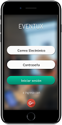
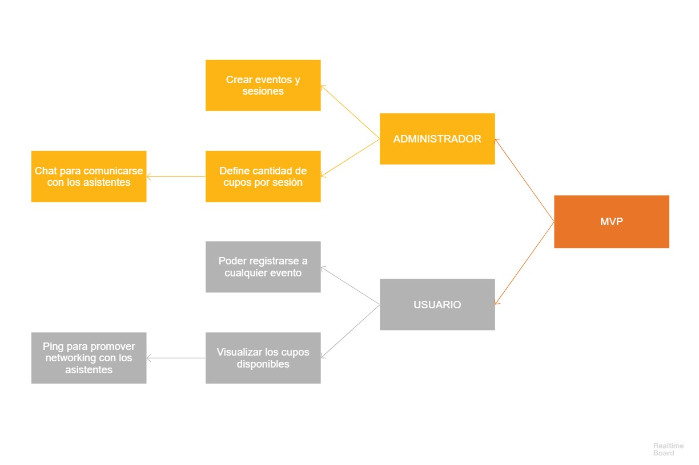
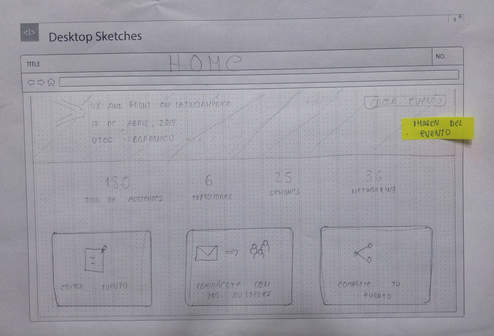
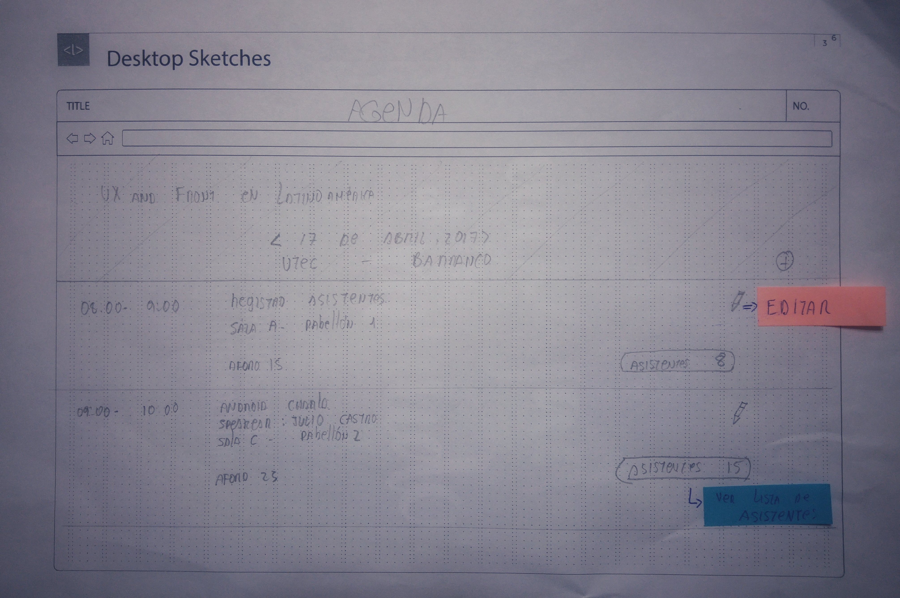

## Eventux

Es una web app que permite gestionar eventos, congresos, ferias y otras actividades de manera fácil y dinámica. 

****

## MVP

Principales requerimientos:

## Research

Existen plataformas con diversidad de funciones y de características, muchas de ellas se centran en mostrar una serie de eventos según los intereses de los usuarios, otras permiten crear eventos y hasta crean un url único para tu evento. Sin embargo, ¿que es lo realmente necesitan nuestras usuarios y los administradores de cada evento?

## Benchmarking

[Guivent](https://www.guivent.com/index.php)

Permite personalizar el evento mediante su plataforma web, realizar la gestión integral y brinda oportunidad de generar negociosa través de la misma. Principales características:

* Se puede sincronizar con Eventbrite
* Utiliza Google Maps
* Se pueden visualizar documentos y videos
* Redes sociales integradas

[Eventbrite](https://www.eventbrite.com.ar/)

Es una plataforma enfocada en la venta de entradas y en la inscripción de participantes a cualquier tipo de evento. Al crear un evento tendrás un sitio web y un formulario de inscripción listo para que vendas tus entradas y los interesados puedan inscribirse. Principales características:

* Se puede integrar el formulario de inscripción en cualquier sitio web
* Comunicación directa con tus participantes
* Permite enviar gratis 2000 invitaciones por día
* Puedes programar el envío de invitaciones
* Guarda la base de datos para posteriores eventos

[Eventtia](https://www.eventtia.com/es/inicio/)

Una plataforma intiutiva y fácil de usar. Logra integrar diferentes componentes que facilitan la gestión de eventos, congresos, ferias, networking, etc. Entre sus principales características son:

* Configurar varios tipo de asistentes
* Crear formularios personalizados
* Aceptar o rechazar inscripciones
* Gestionar invitados
* Generar facturas
* Análisis estadísticos
* Modo offline

## Entrevistas

Tomamos como referencia a [Comunal Coworking](https://comunalcoworking.com/servicios/salas-de-reuniones/). En una entrevista con su personal pudimos detectar lo siguiente:

## Paper prototype

**Versión Movile**

**Versión Desktop**

